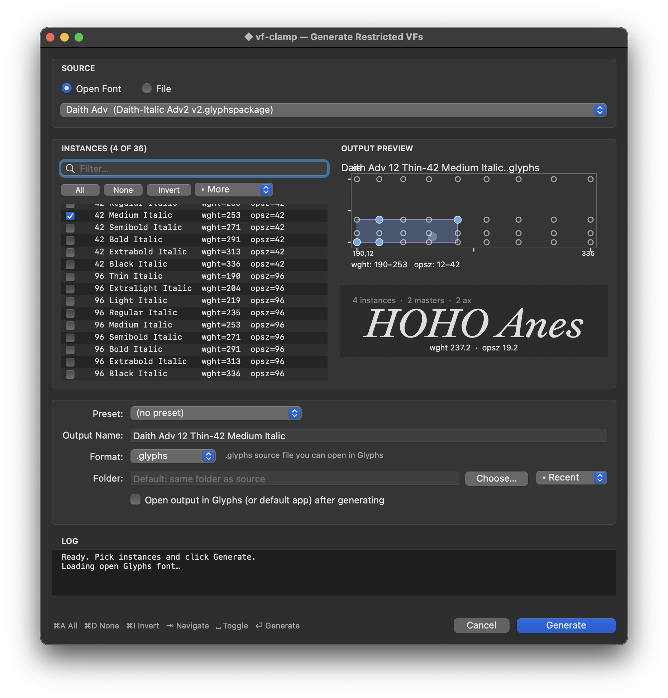

# vf-clamp — RoboFont Extension

**Version:** 1.2.2

Generate restricted variable fonts from named instance ranges. Per-purchase micro-VF delivery for type foundries.

> The screenshot above is taken inside Glyphs.app — RoboFont renders the same chart and animated specimen because the two custom `NSView` modules ([`hull_plot.py`](vf-clamp.roboFontExt/lib/vfClamp/hull_plot.py) and [`preview_view.py`](vf-clamp.roboFontExt/lib/vfClamp/preview_view.py)) are byte-identical between the two plugins. The surrounding chrome (source picker, instance list, output zone, log pane, action bar) is functionally equivalent in RoboFont, drawn with `vanilla.FloatingWindow` instead of `vanilla.Window`.

## What It Does

Select a variable font file, pick one or more named instances, and the extension produces a restricted VF that spans exactly that axis range — with the name table, STAT table, and fvar instances updated to reflect the purchased range.

**Example:** a customer who buys "Light" and "Bold" receives a VF spanning `wght 300–700`, named *Typeface Light-Bold*, not the full family.

This is the native RoboFont version of the [`@liiift-studio/vf-clamp`](https://github.com/Liiift-Studio/vf-clamp) npm package. It calls `fontTools.varLib.instancer` directly — no Node.js or npm required.

## Requirements

- **macOS** (RoboFont is macOS-only)
- **RoboFont 4.0** or later (enforced by `requiresVersionMajor` in `info.plist`)
- **Python 3** — bundled with RoboFont
- **fontTools 4.13+** — bundled with RoboFont (older versions may not support axis-range restriction)
- **vanilla** — bundled with RoboFont
- **brotli** (only required when exporting WOFF2) — bundled with RoboFont

No additional dependencies needed for TTF/OTF output.

## Installation

1. Download or clone this repository.
2. Double-click `vf-clamp.roboFontExt` — RoboFont will install it automatically.
   Or drag the `.roboFontExt` bundle into **Extensions > Show Extensions Folder**.
3. If macOS Gatekeeper blocks the bundle (unsigned), right-click the `.roboFontExt` and choose **Open**.
4. If RoboFont prompts "Extension is not trusted", click **Trust**.
5. Restart RoboFont (or reload extensions).

### Updating

Replace the existing `.roboFontExt` bundle in **Extensions > Show Extensions Folder** with the new download, then restart RoboFont. Settings persist via vanilla's `autosaveName`.

### Uninstalling

Open **Extensions > Extension Manager**, select **vf-clamp**, click **Remove**.

## Usage

1. Go to **Extensions > Generate Restricted VFs…**
2. Click **Select Font…** and choose a variable `.ttf` or `.otf` file.
3. Select one or more named instances from the list (or click **Select All**). The status area previews the computed axis range before you commit.
4. Edit the **Output Family Name** if needed (auto-filled from your selection; remains user-controlled once edited).
5. Choose an output **Format**:
   - **TTF/OTF (original)** — preserves the source font's SFNT format
   - **WOFF** — web-font compression (zlib)
   - **WOFF2** — web-font compression (Brotli)
6. Optionally choose a different **Output Folder** (defaults to the font's folder).
7. Click **Generate** (or press Return).
8. Click **Reveal in Finder** to locate the output file.

The restricted VF is written to the output folder immediately.

## How It Works

- **Axis hull computation:** the extension calculates the min/max value per axis across all selected named instances. When min == max for an axis, that axis is pinned (passed as a scalar to `instancer`). When min != max, the axis is restricted to a `(min, max)` tuple range. Axes not covered by the selection keep their full range.
- **Name table patching:** nameIDs 1, 2, 3, 4, 6, 16, 17, and 25 (where present) are rewritten so the output file self-identifies with the new family name. Stale non-English localized records are dropped to prevent locale-aware renderers from leaking the original family name.
- **fvar instance pruning:** named instances whose coordinates fall outside the restricted range are removed from `fvar.instances`.
- **STAT table pruning:** `AxisValue` records pointing at axis positions outside the restricted range are removed, so OS font menus and CSS don't advertise unreachable styles.
- **Axis default clamping:** if the original `defaultValue` of an axis falls outside the restricted range, it is clamped to the new range to satisfy the OpenType `minValue ≤ defaultValue ≤ maxValue` invariant.
- **DSIG removal:** any digital signature is stripped because instancing invalidates it.
- **head.fontRevision bump:** the derivative's font revision is incremented by 0.001 so font caches distinguish it from the source.
- **Compact naming:** selecting "Inter Light" and "Inter Bold" produces the name "Inter Light-Bold" by stripping shared prefix/suffix words.

> **Note:** select an exported variable font `.ttf` or `.otf` file, not a UFO source. WOFF/WOFF2 input is not currently supported.

## Troubleshooting

- **"Not a variable font"** — the selected file has no `fvar` table. Make sure you are pointing at a variable font binary, not a static instance.
- **"Refusing to write outside selected output folder"** — the family name resolved to a path containing directory separators. Pick a simpler name.
- **"axis default clamped"** warning — the original font's axis default fell outside the range you selected. The output font's `fvar` default has been moved into the legal range; this is required by the OpenType spec.
- **Single-instance selection** — selecting one instance pins every axis and produces what is effectively a static font (instancer removes `fvar` for fully-pinned axes). For a usable variable font, select at least two instances that differ on at least one axis.
- **Gatekeeper blocks the bundle on install** — right-click the `.roboFontExt`, choose **Open**, confirm.
- **fontTools version mismatch** — the controller warns at import time if fontTools is older than 4.13.0. Check RoboFont's Python console.
- **PostScript name issues** — nameID 6 is restricted to ASCII; the extension strips non-ASCII characters and enforces the 63-char limit. nameID 25 (Variations PS Name Prefix) is further restricted to `[A-Za-z0-9]` and ≤27 characters per the OpenType spec.

## License

Proprietary — Liiift Studio. All rights reserved. See `LICENSE` in the repo root.

## Links

- [vfclamp.com](https://vfclamp.com)
- [vf-clamp-robofont (this repo)](https://github.com/Liiift-Studio/vf-clamp-robofont)
- [vf-clamp npm package](https://github.com/Liiift-Studio/vf-clamp)
- [Liiift Studio](https://liiift.studio)

## Changelog

See [CHANGELOG.md](CHANGELOG.md).
